<p align="justify"><h1> AI For Filmmaking </h1> </p>

Code for the blog post [AI for Filmmaking](https://rsomani95.github.io/ai-film-1.html). Detect cinematic [shot types](https://rsomani95.github.io/ai-film-1.html#dataset) in images using a pre-trained `ResNet-50`.

This model recognises 6 shot types:

<p align="justify"><h3>1. Extreme Wide Shot</h3></p>

<p align='center'>
  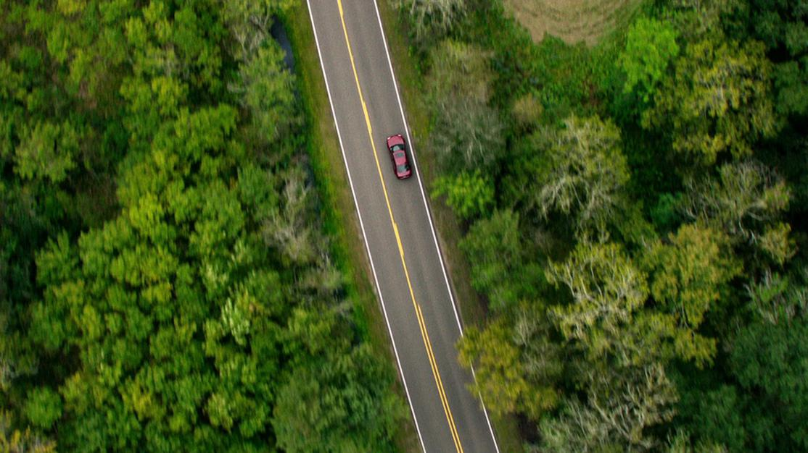 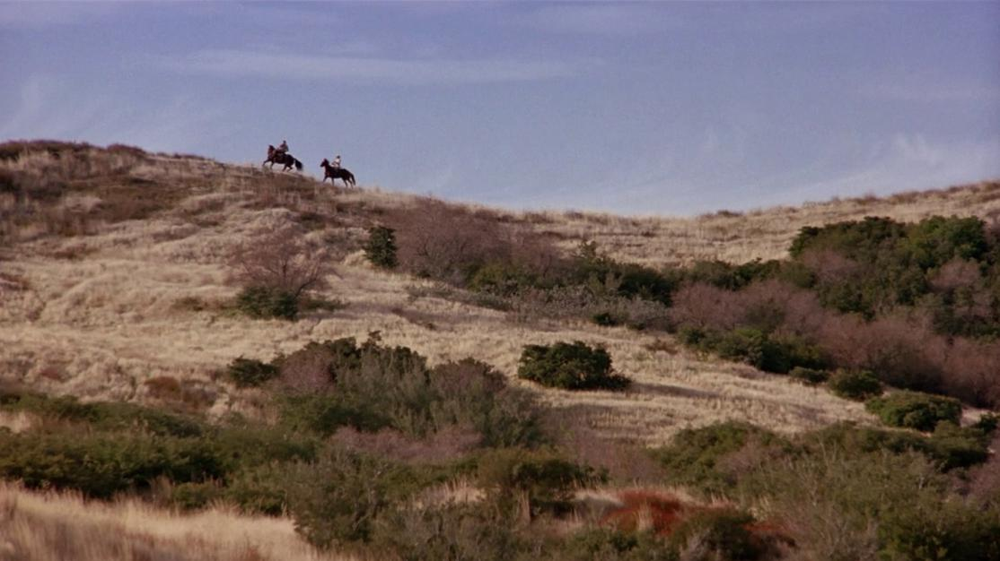
</p>

<p align="justify"><h3>2. Long Shot </h3></p>
<p align='center'>
   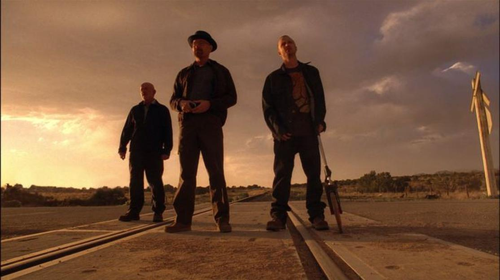
</p>

<p align="justify"><h3>3. Medium Shot </h3></p>

<p align='center'>
  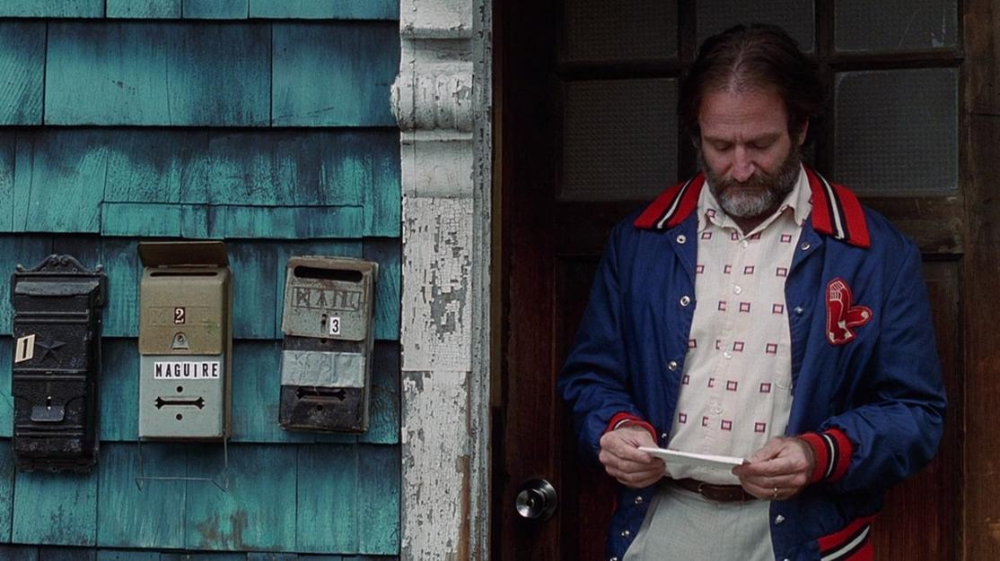 
</p>

<p align="justify"><h3>4. Medium Close Up </h3></p>

<p align='center'>
   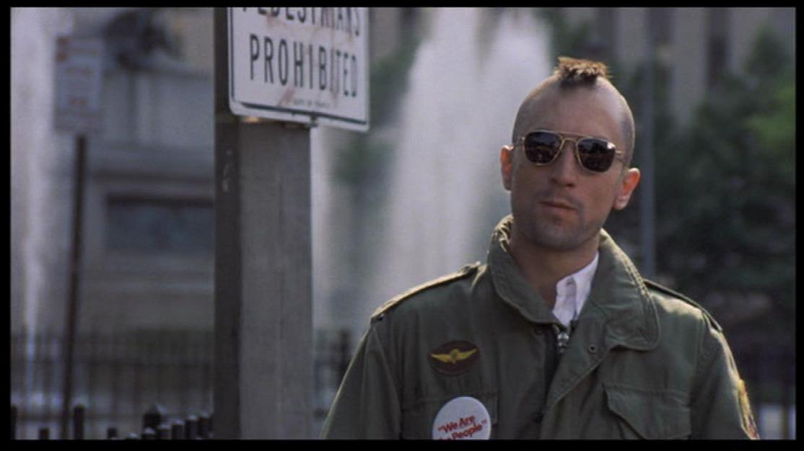
</p>

<p align="justify"><h3>5. Close Up </h3></p>

<p align='center'>
  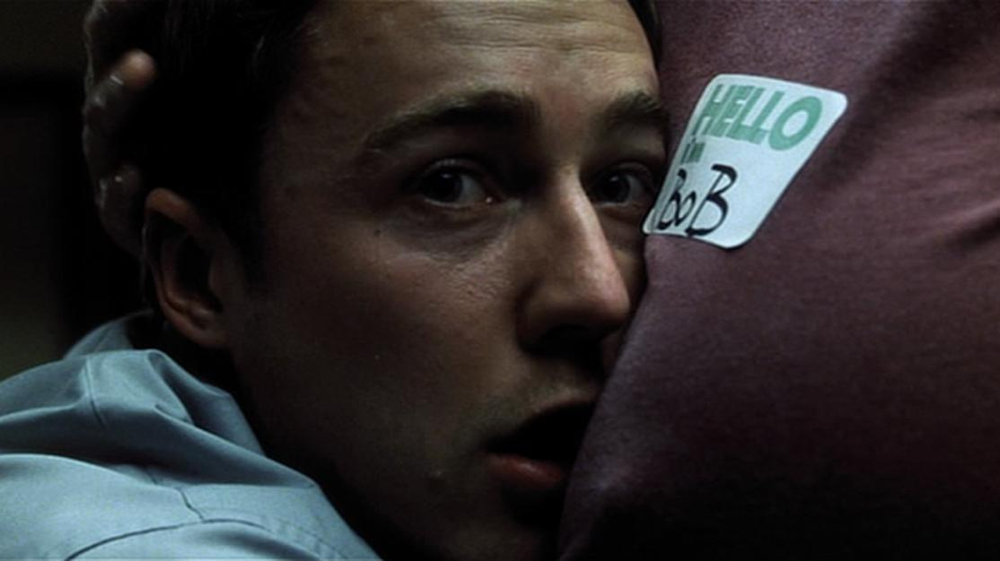 
</p>

<p align="justify"><h3>6. Extreme Close Up </h3></p>

<p align='center'>
   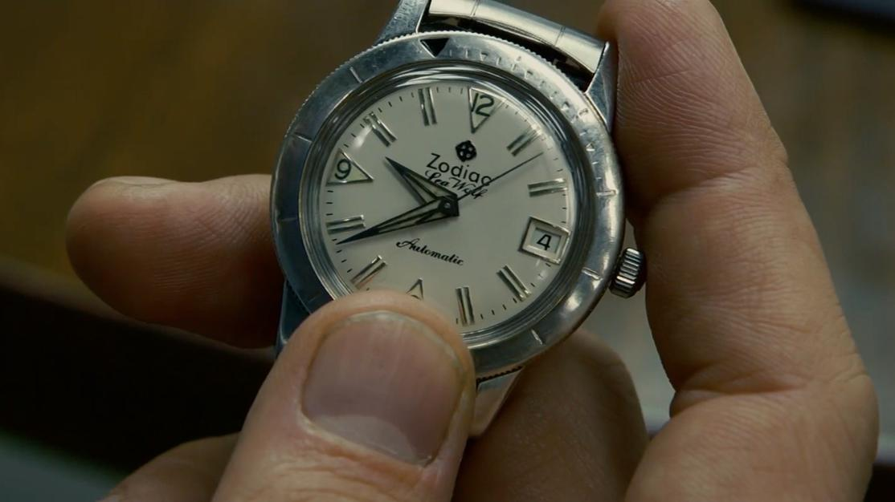
</p>

<br>

In the not so distant future, it will also recognise:

<p align="justify"><h3> Wide Shots </h3></p>

<p align='center'>
  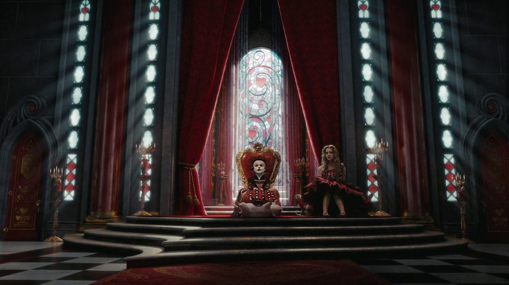 
</p>

<p align="justify"><h3> Medium Long Shots </h3></p>

<p align='center'>
  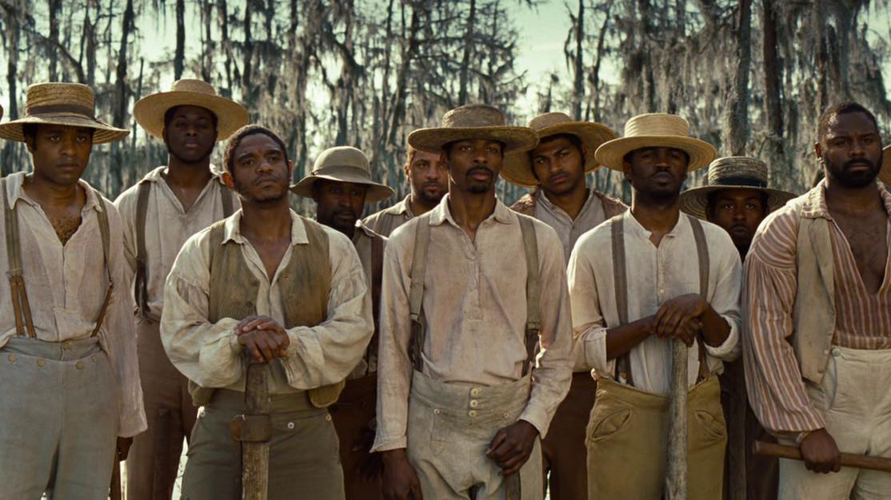 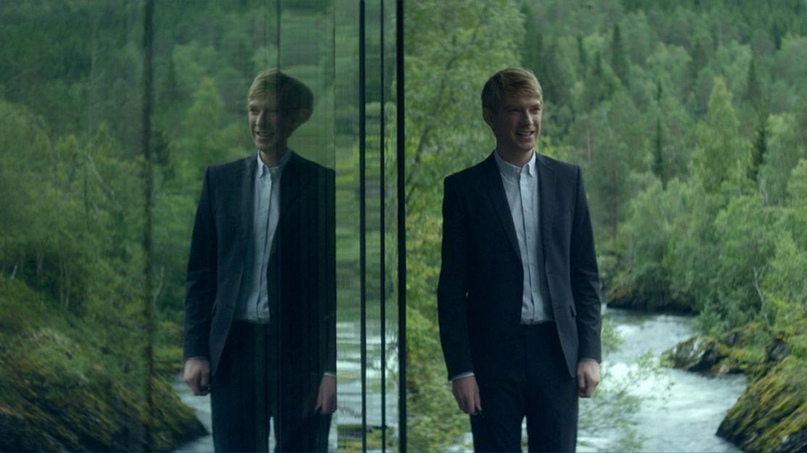
</p>

<h3> Requirements </h3>

`fastai` — Installation instructions [here](https://docs.fast.ai/install.html). You can use this code _without a GPU._

<h3> Usage </h3>

After downloading the directory, run `bash get_data_model.sh` to download the model and the validation set. A dummy training set is downloaded too to enable the generation of heatmaps.

<h4> Predict Shot Types </h4>

```bash
python get-preds.py                     \
    --path_base  ~/shot-type-classifier \
    --path_img   ~/images               \
    --path_preds ~/images/preds         \
```

Where `path_base` is the directory path, `path_img` the path to the images you want to evaluate, and `path_preds` where you'd like to store the predictions (`.csv` files). The script create the `~/images/preds` folder if it doesn't exist.

<p align='center'>
   
</p>

<h4> Heatmaps </h4>

```bash
python get-heatmaps.py                 \
    --path_base ~/shot-type-classifier \
    --path_img  ~/images               \
    --path_hms  ~/images/heatmaps      \
    --alpha 0.8
```

Where `path_base` is the directory path, `path_img` the path to the images you want to evaluate, `path_hms` where you'd like to store the heatmaps, and `alpha` the blending value of the heatmap with the original image. An `alpha` value of `1.0` produces the heatmap only. The script create the `~/images/heatmaps` folder if it doesn't exist.

<p align='center'>
  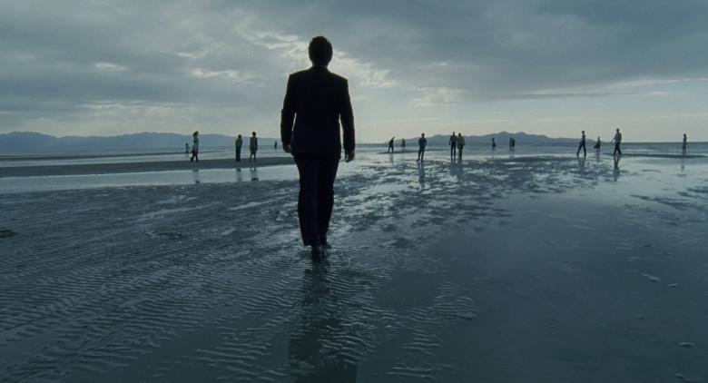 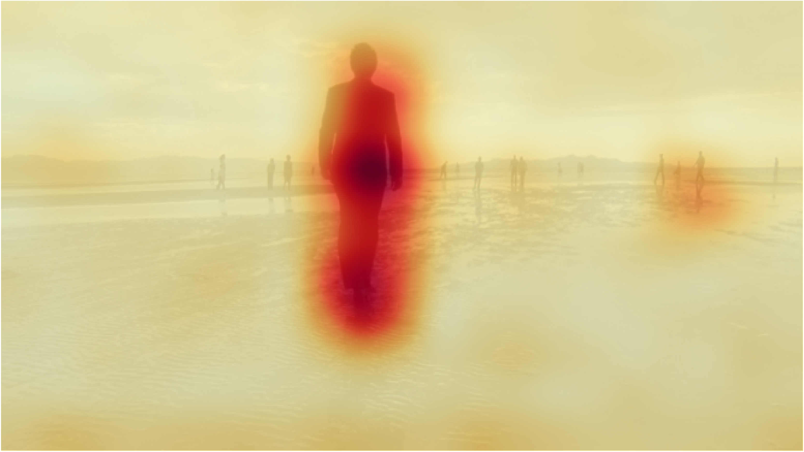
</p>

<p align="justify"><h3>1. License</h3></p>
This repository is released under the [Creative Commons Attribution-NonCommercial 4.0 (CC BY-NC 4.0)](https://github.com/rsomani95/shot-type-classifier/blob/master/LICENSE). See [here](https://creativecommons.org/licenses/by-nc/4.0/) for more details.
